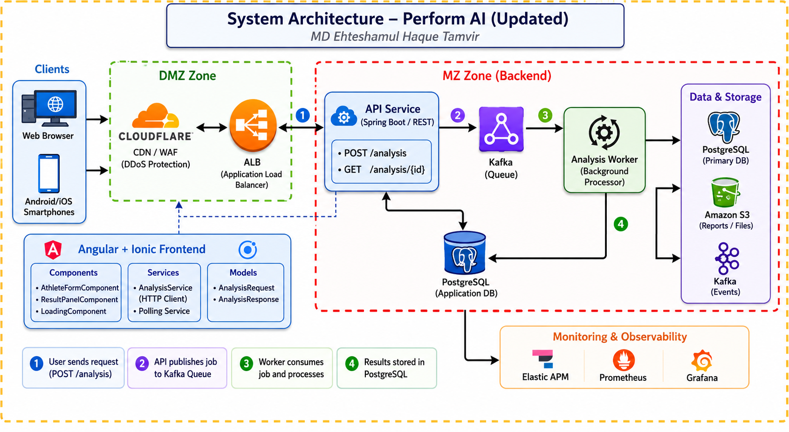

# Perform AI — System Architecture

Modern asynchronous system architecture designed for scalable athlete analysis processing using event-driven backend patterns and Angular/Ionic frontend integration.

---

## Table of Contents

- [High-Level Architecture](#high-level-architecture)
- [Architecture Goals](#architecture-goals)
- [System Components](#system-components)
- [Request Lifecycle](#request-lifecycle)
- [Frontend Architecture](#frontend-architecture)
- [Scalability Considerations](#scalability-considerations)
- [Future Enhancements](#future-enhancements)
- [Author](#author)

---

## High-Level Architecture



```
Clients
(Web / Android / iOS)
        │
        ▼
Cloudflare (CDN / WAF)
        │
        ▼
Application Load Balancer (ALB)
        │
        ▼
Analysis API Service (REST)
        │
 ┌──────┴────────┐
 │               │
 ▼               ▼
PostgreSQL     Kafka Queue
(Requests DB)      │
                   ▼
         Analysis Worker Service
          (Background Processor)
                   │
                   ▼
              PostgreSQL
             (Results Store)
```

---

## Architecture Goals

- Scalable asynchronous processing
- Clean separation of concerns
- Event-driven backend workflow
- Maintainable frontend structure
- Production-ready infrastructure design
- Monitoring & observability support

---

## System Components

### Client Layer

Supports:

- Web Browser
- Android Application
- iOS Application

Frontend built using Angular and Ionic Framework.

### Edge & Security Layer

**Cloudflare** provides:

- CDN
- WAF
- DDoS Protection
- Edge caching
- SSL termination

### Traffic Distribution Layer

**Application Load Balancer (ALB)** is responsible for:

- Request routing
- Load balancing
- High availability
- Backend service distribution

### Backend Services

#### Analysis API Service

REST-based backend service responsible for:

- Receiving analysis requests
- Persisting request metadata
- Publishing asynchronous jobs to Kafka
- Returning processing status
- Serving analysis results

| Method | Path              | Description                     |
|--------|-------------------|---------------------------------|
| POST   | `/analysis`       | Submit a new analysis job       |
| GET    | `/analysis/{id}`  | Poll status and result of a job |

#### Kafka Queue

Acts as the asynchronous messaging layer.

Responsibilities:

- Decouples API from processing logic
- Enables scalable background processing
- Improves reliability and throughput
- Supports event-driven architecture

#### Analysis Worker

Background worker service responsible for:

- Consuming Kafka jobs
- Simulating athlete analysis processing
- Generating analysis results
- Updating persistent storage

### Data Layer

**PostgreSQL** is used for:

- Analysis request persistence
- Result storage
- Status tracking
- Transaction consistency

### Monitoring & Observability

| Tool          | Purpose                                          |
|---------------|--------------------------------------------------|
| Elastic APM   | Application performance monitoring and tracing   |
| Prometheus    | Metrics collection and monitoring                |
| Grafana       | Visualization dashboards and operational monitoring |

---

## Request Lifecycle

```
1. User submits athlete analysis request
2. Request passes through Cloudflare
3. ALB routes request to API Service
4. API stores request metadata
5. API publishes job to Kafka
6. Worker consumes and processes job
7. Results stored in PostgreSQL
8. Frontend polls result endpoint
9. Completed analysis returned to client
```

---

## Frontend Architecture

```
Angular + Ionic App
│
├── Components
│     ├── Athlete Input
│     ├── Results Panel
│     └── Loading State
│
├── Services
│     └── Analysis API Service
│
└── Models
      ├── Analysis Request
      └── Analysis Response
```

---

## Scalability Considerations

The architecture supports:

- Horizontal API scaling
- Independent worker scaling
- Queue-based workload distribution
- Stateless service deployment
- Cloud-native deployment strategy

---

## Future Enhancements

- [ ] Kubernetes deployment
- [ ] Redis caching
- [ ] WebSocket live updates
- [ ] JWT authentication
- [ ] API Gateway integration
- [ ] CI/CD pipeline
- [ ] OpenTelemetry tracing
- [ ] Multi-region deployment

---

## Author

**MD Ehteshamul Haque Tamvir**
Software Architect | Distributed Systems | Cloud Infrastructure | Mobile & Backend Engineering
